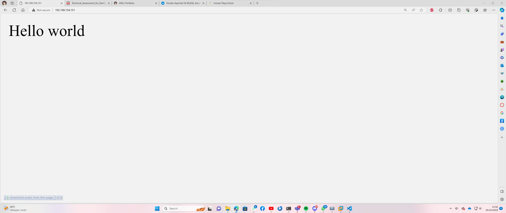
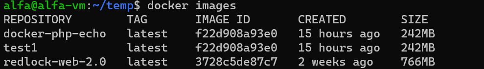
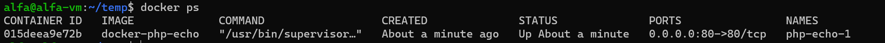

# PHP Hello Word Echo Server in Docker

`25 October 2023`

This project is used as my Technical Assessment for DevOps
Engineer Intern in PT. Inovasi Daya Solusi.

## Features
- Image based on Ubuntu 22.04
- Installed app : Apache2, Supervisor, PHP 8.1
- Apache2 is used to host PHP Echo file
- Supervisor is used to manage multiple processes running inside the container
- PHP is used to run PHP Code

## Deployment

1. Build Docker Image with name "docker-php-echo"

```bash
  docker build -t docker-php-echo .
```

2. Check the image with Docker Image List

```bash
  docker images
```

3. Deploy Docker Container with name "php-echo-1" with our image and port 80. Make sure that there are no service using port 80!

```bash
  docker run -p 80:80 --name php-echo-1 -d docker-php-echo
```

4. Check the container with Docker Container List

```bash
  docker ps
```

5. Voila! Access `localhost` or `Host IP Address` in the browser

## Screenshots

Browser



Docker Image List



Docker Container List



## Run Environtment

**Host**
- Ubuntu 22.04 - VMWare
- Docker 24.0.6, build ed223bc

**Client**
- Windows 11 - Native
- Microsoft Edge 118.0.2088.61

## Related

Here is my related project

[Docker Apache2 & MySQL Automation](https://bit.ly/AlfaDocker1)


## 🔗 Links
[](https://naufalalfadli.netlify.app)
[](https://www.linkedin.com/in/ahmad-naufal-abdurrohman-alfadli-84a824190/)
[](https://www.instagram.com/naufalalfa_/)


